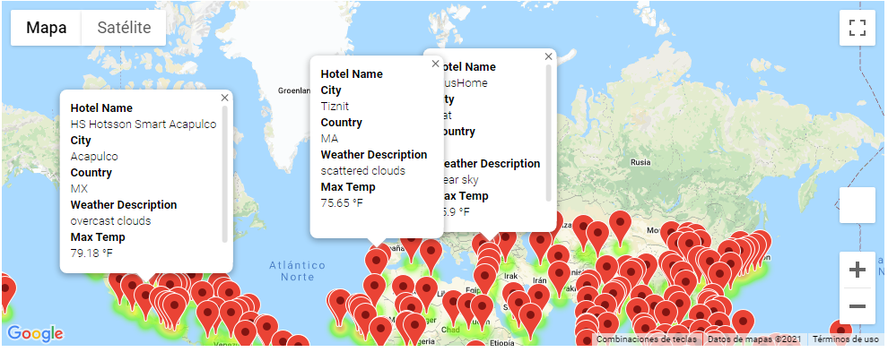
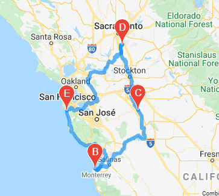
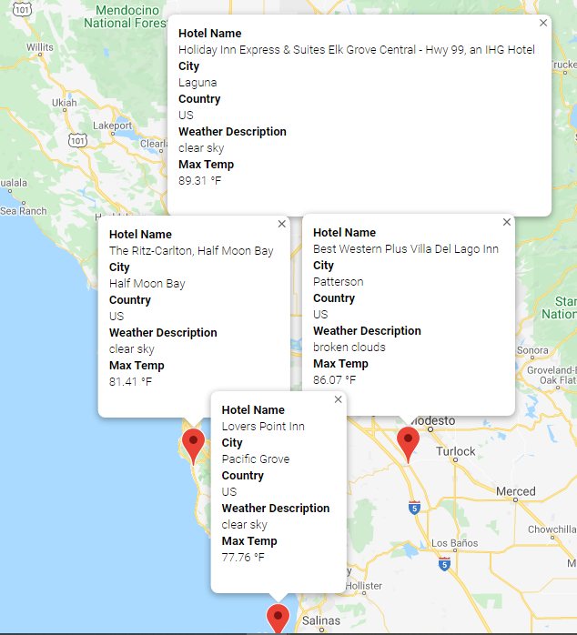

# Challenge 6

## Overview
During this assignment we went over the many uses of APIs and Google integrations for maps, how they could be utilized for projects and how they add to our understanding of python and coding in general

## Part 1
During part 1 we refractored the code for getting hotels and cities and to be able to search wit a certain criteria.

## Part 2
For part 2 we again refractored some code and added the data for weather description.

## Part 3
Lastly for part 3 we learned how to use the directions API and how to make routes and overlay them on the map

